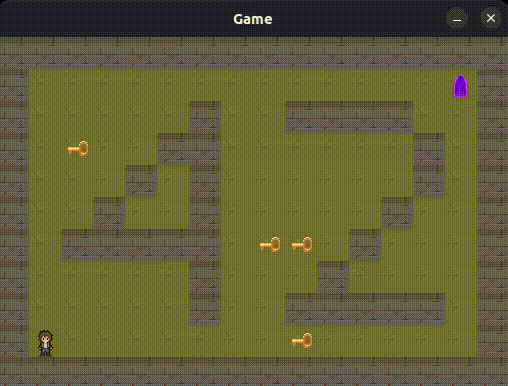
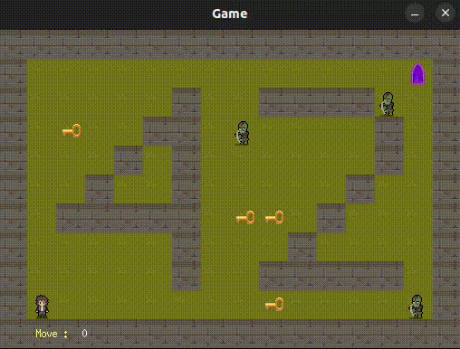
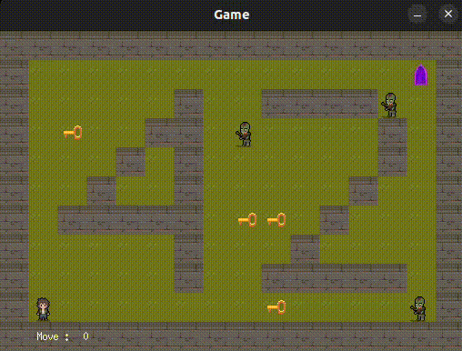

<h1 align="center">
42-so_long 125/100
</h1>
<div align="center">
  
</div>

# Build
```
git clone https://github.com/42Paris/minilibx-linux.git
```
```
|
|- minilibx-linux/
|- src/
|- headers/
|- ...
|- Makefile
```
# Mandatory
```
make && ./so_long map/map2.ber
```
<div align="center">
  
</div>

# Bonus
```
make bonus && ./so_long_bonus map/map_bonus1.ber
```

## Lose

<div align="center">
  
</div>

## Win
<div align="center">
  
</div>
